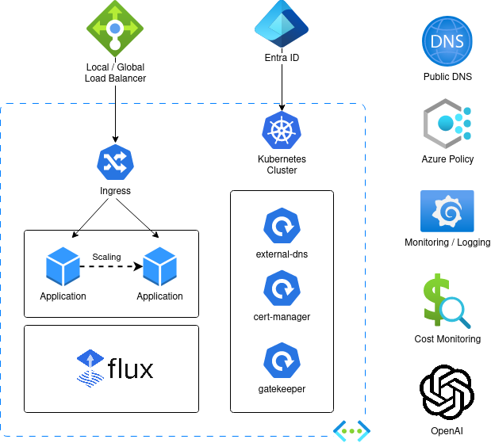

## Hackathon 

The Hackathon comprises of 10 main challenges in total.

Challenges 00, 01 and 02 focus on setting up the environment and should be completed by all participating teams as a prerequisite to proceed with the other challenges. Remaining challenges are non-linear and might be completed in any order.
 
Each challenge contains a description of its subject, an overview of steps to be taken and a definition of success criteria to validate its fulfillment. It also contains links to useful learning resources and optional challenges / subtasks.
 
Progress of each team is tracked within a central dashboard and can be accessed through the following [link](https://noibitlab.grafana.net/public-dashboards/4dca8db80a4e4d40a8a9ec156c9804f0?orgId=1&refresh=1m).


## Challenges


If not specified otherwise, create all Azure resources in **Poland Central** region.


### Challenge 00: [Prerequisites](challenge00.md)
* Prepare your workstation to work with Azure, Kubernetes and git

### Challenge 01: [Create AKS and run an application](challenge01.md)
* Create the environment for running applications in Kubernetes

### Challenge 02: [Ingress Controller and DNS for Public IPs](challenge02.md)
* Explore integrating DNS with Kubernetes services and configuring an Ingress Controller

```
# before applying
cat <<-EOF > azure.json
{
  "tenantId": "$(az account show --query tenantId -o tsv)",
  "subscriptionId": "$(az account show --query id -o tsv)",
  "resourceGroup": "$AZURE_DNS_ZONE_RESOURCE_GROUP",
  "useManagedIdentityExtension": true,
  "userAssignedIdentityID": "$IDENTITY_CLIENT_ID"
}
EOF
kubectl create secret generic azure-config-file --namespace "default" --from-file ./azure.json
```

### Challenge 03: [AKS Security (Azure Policies)](challenge03.md)
* Easy way how to detect and control some of Kubernetes security aspects

### Challenge 04: [Basic Monitoring and Logging](challenge04.md)
* Start getting metrics and logs and have an overview over the environment

### Challenge 05: [Autoscaling](challenge05.md)
* Enable autoscaling on stateless workload using application-level metrics

### Challenge 06: [Cost monitoring](challenge06.md)
* Cost governance with Kubecost

### Challenge 07: [AI Chatbot](challenge07.md)
* OpenAI and Semantic Kernel

### Challenge 08: [Global Load Balancing](challenge08.md)
* Balance traffic across regions

### Challenge 09: [GitOps with Flux](challenge09.md)
* Offload workload's lifecycle to git repository
