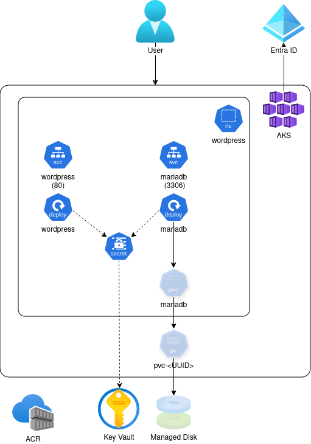

# Challenge 01 - Create AKS and run an application

 [< Previous Challenge](./challenge00.md) - **[Home](README.md)** - [Next Challenge >](./challenge02.md)

## Description

To run some workload in AKS cluster in a robust and secure way we need to rely not only on AKS cluster.



---

### 0. Pre-deployed environment overview
* One subscription for all teams
  * **Noibit Hackathon**


* Shared Resource Group `rg-hackathon-shared`
  * Azure Container Registry (ACR) - `hackathon`
  * Public DNS zone - `teamX.<hackathondomain>.noibithackathon.cloud`


* Team's Resource Groups - `rg-hackathon-teamX`
  * Azure Virtual Network - `vnet-hackathon-plc-teamX`
  * Azure Key Vault - `kv-hackathon-plc-teamX`


* Naming convention
  * Try to keep the convention when creating Azure resources.
  * `<resource type>-<project>-<region shortcut>-team<number>`

### 1. Deploy Azure Kubernetes Service (AKS) cluster
- The Kubernetes cluster:
  - is deployed in Poland Central region
  - has name as stored in sourced env. variable `$CLUSTERNAME`
  - is placed in existing resource group `$RGNAME`
  - use the maximum number of Availability Zones
  - is installed with the default Kubernetes version
  - has set authentication with Azure RBAC
  - has **one node pool** with **two nodes**
    - node size is D2ds
    - manual autoscaling
    - nodes have **no taints!**
  - has Azure CNI network configuration
  - is placed in existing VNET and subnet
  - has disabled Network Policy
  - is not attached to ACR
  - has disabled Azure Policy
  - has disabled monitoring, logging and alerting
  - has disabled secret store CSI driver

**NOTE:** [Here](./images/challenge01-aks-settings.png) is the summary of the settings.

### 2. Attach Azure Container Registry
- attach shared ACR (exists in `rg-hackathon-shared`) to the AKS cluster
  - **NOTE:** Attaching an ACR requires you to have "Owner" or "Azure account administrator" role on the Azure subscription. If this is not possible then someone who is an Owner can do the attach for you after you create the cluster.

### 3. Enable Key Vault secret store CSI driver
- **NOTE:** access to the Key Vault secrets is managed by using managed identity and federated credentials

### 4. Once the cluster is running
- Use kubectl to prove that the cluster is a multi-node cluster and is working properly.
- Adapt the WordPress application described [here](https://github.com/docker/awesome-compose/blob/master/wordpress-mysql/compose.yaml) so that it runs as two deployments in Kubernetes
  - no need to create persistent storage (optional challenge)
  - no need to expose it publicly (this is task for next challenge)
    - **NOTE**: You can check the app by forwarding port to your laptop and pointing browser to [localhost:8080](http://localhost:8080)
      ```commandline
      kubectl -n wordpress port-forward service/wordpress 8080:80
      ```

## Success Criteria

1. Show that a new, multi-node AKS kubernetes cluster exists and nodes are running in multiple availability zones.
1. Show that user Kubernetes permissions are managed by Entra ID RBAC.
1. Show running WordPress

## Learning Resources

- [Azure Container Registry](https://learn.microsoft.com/en-us/azure/container-registry/container-registry-get-started-azure-cli)
- [Azure Kubernetes Service (AKS) and availability zones](https://docs.microsoft.com/en-us/azure/aks/availability-zones)
- [Access and identity options for Azure Kubernetes Service (AKS)](https://learn.microsoft.com/en-us/azure/aks/concepts-identity)
- [Azure Key Vault provider for Secrets Store CSI Driver](https://learn.microsoft.com/en-us/azure/aks/csi-secrets-store-driver)
- [Use Microsoft Entra Workload ID with Azure Kubernetes Service (AKS)](https://learn.microsoft.com/en-us/azure/aks/workload-identity-overview)
- [Azure Disk Storage](https://learn.microsoft.com/en-us/azure/aks/azure-csi-disk-storage-provision)

## Optional challenges
* Store the secrets for the WordPress application in Key Vault
* Use persistent storage for MariaDB database
* Build and run an application chosen/created by you
