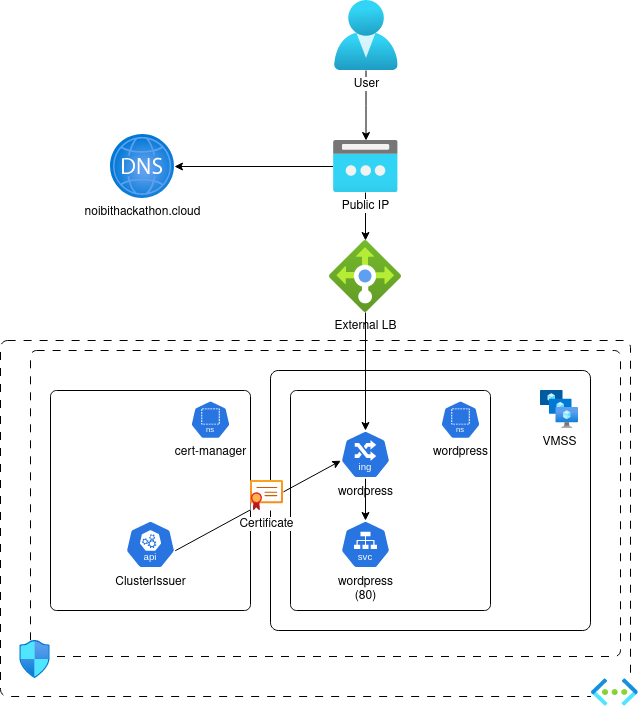

# Challenge 02 - Ingress Controller and DNS for Public IPs

 [< Previous Challenge](./challenge01.md) - **[Home](README.md)** - [Next Challenge >](./challenge03.md)

## Description

Now it's time to get application visible using additional Azure and Kubernetes resources.

---

### 1. Public IP and DNS
Modify the Service for WordPress application as it is publicly accessible 
   * **NOTE:** Do not use ingress. It will come in next step.
   * Use Azure Load Balancer
   * Use Azure Public DNS zone `teamX.<hackathondomain>.noibithackathon.cloud` which is pre-created in `rg-hackathon` resource group.
     * NOTE: Use ExternalDNS which allows you to control DNS records dynamically via Kubernetes resources in a DNS provider-agnostic way

### 2. Ingress Controller
To be able to use to host multiple applications and route http requests we will deploy ingress controller.
* Deploy nginx ingress controller. (Hint: use helm)
* Redeploy the WordPress application using Ingress 

### 3. Secure connection with TLS certificate
* Use cert-manager for that purpose
* Use Let's Encrypt certificate

## Success Criteria

1. WordPress is deployed and available on `https://wordpress.<TEAM_NAME>.<hackathondomain>.noibithackathon.cloud`

## Learning Resources

- [Networking concepts for applications in Azure Kubernetes Service (AKS)](https://learn.microsoft.com/en-us/azure/aks/concepts-network)
- [ExternalDNS synchronizes exposed Kubernetes Services and Ingresses with DNS providers](https://github.com/kubernetes-sigs/external-dns)
- [Create an unmanaged ingress controller](https://learn.microsoft.com/en-us/azure/aks/ingress-basic?tabs=azure-cli)
- [cert-manager](https://cert-manager.io/docs/)

## Optional challenges
* Secure connection with self-signed TLS certificate using Key Vault
* Deploy another application and publish it on different URL
* Reconfigure external-dns not to remove DNS record when k8s manifest is deleted
